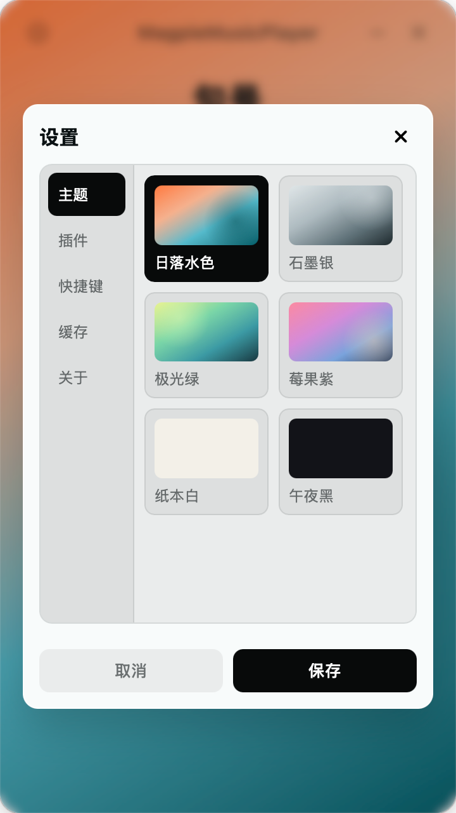

# Magpie Music Player

Magpie Music Player 是一个本地优先的桌面音乐播放器，基于 Tauri、Vue 和 TypeScript 构建。它关注本地音乐管理、播放列表、歌词与歌曲信息展示、缓存管理，以及可控的插件扩展能力。

项目不会内置公共音乐搜索、公共歌词搜索、公共歌曲信息搜索或歌曲下载服务。涉及第三方内容来源的能力应由用户自行选择可信插件完成，并由插件作者和使用者共同确认内容来源、平台条款和版权许可。

## 应用截图

  

  
  
  

## 项目地址

- GitHub: [hpyer/magpie-music-player](https://github.com/hpyer/magpie-music-player)
- Gitee: [Hpyer/magpie-music-player](https://gitee.com/Hpyer/magpie-music-player)

Gitee 仓库仅作为镜像，方便国内访问。Issue、Release 和主要开发以 GitHub 仓库为准。

## 主要功能

- 扫描和管理本地音乐目录。
- 播放本地音乐和用户授权来源的远程音乐。
- 创建、管理和播放列表。
- 管理歌词、封面、歌曲信息和媒体缓存。
- 配置主题、快捷键、缓存目录和容量上限。
- 安装、启用、禁用、配置和删除插件。
- 通过签名黑名单阻止已知风险插件。

## 安装

请前往 GitHub Releases 下载对应系统的安装包：

- macOS: `.dmg`
- Windows: `.exe` 或 `.msi`
- Linux: `.AppImage`、`.deb` 或 `.rpm`

如果你在国内访问 GitHub 较慢，可以通过 Gitee 镜像查看源码和文档；正式发布包仍以 GitHub Releases 为准。

## 基本使用

1. 安装并启动 Magpie Music Player。
2. 在设置中添加本地音乐目录。
3. 等待应用扫描音乐文件。
4. 在本地音乐或播放列表中选择歌曲播放。
5. 按需调整主题、快捷键、缓存目录和缓存大小。

插件是可选能力。只在你信任插件来源、理解插件权限并确认对应服务或内容来源合法合规时安装插件。

## 插件

Magpie Music Player 支持插件扩展播放列表来源、歌词搜索、歌曲信息搜索、媒体地址解析等能力。插件安装时会声明权限、能力和网络来源，应用会向用户展示这些信息。

### 官方插件

官方插件随项目源码维护，发布包存放在对应插件目录的 `release/` 目录，并纳入 git 管理。后续新增官方插件时，会继续加入下面的列表。

| 插件 | 描述 | 下载 |
| --- | --- | --- |
| Navidrome | 连接 Navidrome 或兼容 Subsonic API 的服务，提供远程播放列表、媒体地址解析和歌词读取能力。 | [GitHub](https://raw.githubusercontent.com/hpyer/magpie-music-player/main/plugins/navidrome/release/cn.hpyer.magpie.navidrome-1.0.1.zip) / [Gitee](https://gitee.com/Hpyer/magpie-music-player/raw/main/plugins/navidrome/release/cn.hpyer.magpie.navidrome-1.0.1.zip) |

请注意：

- 插件不是播放器本体的一部分。
- 第三方插件由插件作者独立发布和维护。
- 本项目不托管、不索引、不推荐未经授权的媒体、歌词、封面或元数据来源。
- 用户应只安装可信来源插件，并自行确认插件行为符合所在地法律、平台条款和内容许可。

## 隐私

播放器默认以本地优先为原则：

- 本地音乐目录、播放列表、收藏、播放状态、应用设置、插件配置和缓存配置保存在用户设备本地。
- 应用设置和播放列表等 JSON 数据会使用应用本地 AES-GCM 密钥加密后写入 AppData 目录。
- 核心播放器不内置统计、遥测或账号系统。
- 黑名单检查只下载公开签名列表并在本地比较，不上传已安装插件列表、插件配置、媒体库、播放记录或本地路径。
- 插件只有在用户安装、启用并配置后，才会按照其声明能力访问对应服务。

第三方插件可能会访问用户配置的服务，例如 Navidrome 服务或其他插件作者提供的 API。插件的数据处理行为由插件作者负责。

## 版权与许可

核心播放器应用使用 GNU AGPLv3 许可。

插件类型包、插件 CLI、官方开源插件和模板使用 MIT 许可，方便插件生态独立开发和复用。

使用本项目或插件时，请遵守所在地法律法规、第三方平台条款以及相关内容版权许可。本项目不授权任何未经许可的内容获取、分发或下载行为。

## 开发文档

根目录 README 只保留项目介绍、普通用户安装使用说明、隐私和许可信息。开发相关内容请查看对应目录：

- [核心播放器应用开发说明](./app/README.md)
- [插件开发说明](./plugins/README.md)
- [npm 包说明](./packages/README.md)
- [发布流程](./RELEASE.md)
- [变动历史](./CHANGELOG.md)
